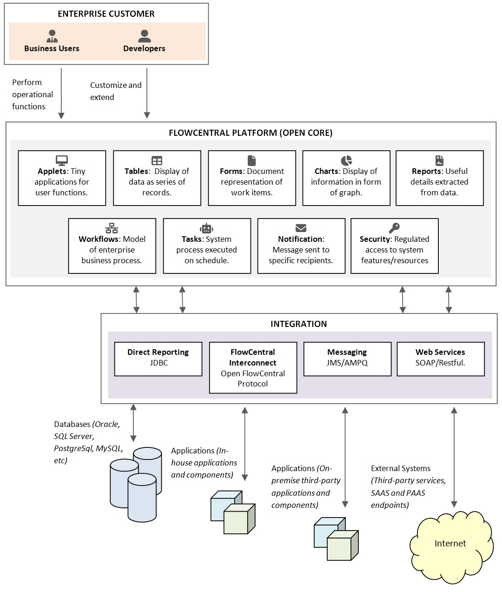

# Home
FlowCentral platform is an open-source application platform, composed of an extensible Java-based framework, tools and a library of reusable components, that makes it much easier for software development teams to build enterprise workflow applications fast.

Provided out of the box are end-user and system functionality, typically required of enterprise applications, and a set of low-code development tools.

**Dashboards & Reporting:** Platform supports the design of multiple dashboards that are made available for viewing at the end-user view. Basic ad-hoc reports can be generated from the platform end-user view with no need for template design or coding. Reports can be generated in Portable Document Format (PDF), Microsoft Excel and Comma Separated Values (CSV) format. New report  types can be configured for specific data filter rules and runtime input.

**User & Role Management:** Access to platform end-user functionality is managed by the definition of roles and  assigning them to various users as required. Applications, applets, CRUD actions, workflow step participation, dashboard views, report generation and more are all defined at a fine-grained level as  privileges. Assignment of these privileges to specific roles is managed from the platform end-user  view. New application components defined using the development tools are automatically added to  the privileges mechanism and made available to assignment.

**Database Connectivity:** Support is provided for connection to multiple data sources from different RDBMS providers simultaneously. Popular databases like Oracle, SQL Server, PostgreSQL and MySQL are supported out-out-of the box. Automatic database schema management feature is also available. As entities are defined and altered on the platform, corresponding database tables and views are automatically created and updated accordingly.

**Integration:** Framework provides extension points that allows for integration to other in-house or third-party systems and applications. Integrate by connecting to SOAP/REST web serviceend-points, by sending and receiving messages using JMS/AMPQ, by integrating at framework level using Open FlowCentral Interconnect (SpringBoot, C#* applications, etc) and Direct Reporting.

**Workflow:** Implement workflows that model any business process by defining sequences of automatic steps and user interaction steps through which documents (work items) will flow.Implement any user action and any number of required approvals. Send notifications and alerts at specific steps and events in your workflow.

**Development Studio:** A web-based integrated development studio allows developers to extend the platform and build applications with little or no code. Unlimited database entities can be defined with the ability to specify different types of fields. Foreign keys, unique constraints and indexes can also be defined. New applications, applets, widgets, charts, notification templates and reports can be configured. Designers are available to create forms, tables, workflows and dashboards* usingdrag-and-drop. The studio provides the means of wiring these components together as they are being defined.

**Multiple Deployment Options:** Package as executable JAR with embedded web server and deploy standalone or in Docker container. Package as a WAR file and deploy in any standard Java Servlet web server or application server (Apache Tomcat, Jetty Server, etc). Run multiple instances in a cluster for horizontal scaling. Use as a monolithic application or as a microservice architecture component.

  <h4>Architecture</h4>

  

